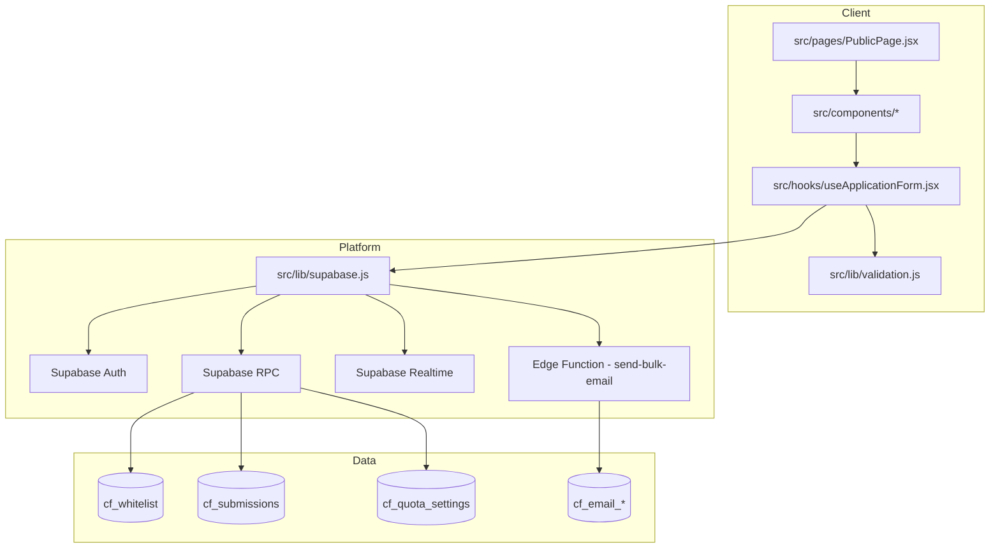

# Mimari ve Klasör Yapısı

## Mimari Prensipler
- UI ve iş kuralı ayrımı: Görsel katman `components`, form orkestrasyonu `hooks` içinde.
- Backend logic merkezi: Kritik iş kuralları Supabase RPC fonksiyonlarına taşınmış durumda.
- Güvenlik: İstemci tarafı doğrulama yalnızca UX amaçlıdır; nihai doğrulama DB katmanında yapılır.
- Dağıtık sorumluluk: E-posta gönderimi Edge Function ile asenkron yönetilir.

## Uygulama Katmanları


## Klasör Yapısı (Bakım Odaklı)

```text
src/
  components/
    admin/              # Admin UI modülleri
    form/               # Başvuru adımları
    layout/, ui/        # Sunum bileşenleri
  hooks/
    useApplicationForm.jsx
  lib/
    supabase.js         # Client init
    validation.js       # Domain doğrulama kuralları
  pages/
    PublicPage.jsx

supabase/
  migrations/           # İş kuralı evrimi (single source of truth)
  functions/            # Edge functions

e2e/                    # Playwright senaryoları
tests/                  # Integration + stress
```

## Temel Tasarım Desenleri

### 1) Orchestration Hook Pattern
- `useApplicationForm` state machine benzeri bir akış yönetir (`step1 -> step2 -> step3`).
- RPC çağrıları tek yerde toplandığı için davranış tutarlılığı yüksektir.

### 2) RPC-Centric Domain Logic Pattern
- Quota, lock, duplicate, debtor kontrolleri SQL fonksiyonlarında merkezi tutulur.
- Frontend sadece input toplama ve sonuç işleme sorumluluğundadır.

### 3) Async Side-Effect Isolation Pattern
- E-posta operasyonları Edge Function üzerinden tetiklenir.
- Başvuru akışı, e-posta hatalarından etkilenmeden tamamlanabilir.

### 4) Defensive Runtime Fallback Pattern
- `supabase` istemcisi env eksikse `null` dönerek public sayfanın renderını engellemez.
- Countdown ayarı DB okunamazsa env fallback ile devam eder.

## Dış Kaynak Ekip için Operasyonel Notlar
- `supabase/migrations` dosyaları kronolojik ve davranışsal bağlam içerir; migration açıklama yorumları korunmalıdır.
- `check_and_lock_slot`, `submit_application`, `get_ticket_stats`, `get_yedek_sira` fonksiyonları sistemin kritik çekirdeğidir.
- `/apply` route'u bilerek devre dışıdır; lock bypass engeli olarak korunmalıdır.
