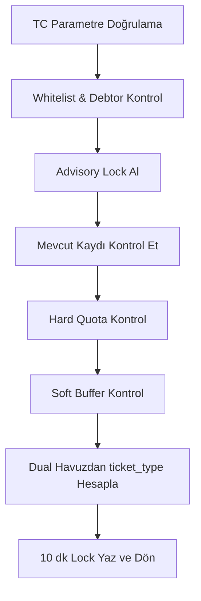

# Teknik Karar Kayıtları (ADR) ve AI Mantık Açıklamaları

Bu doküman, bakım sırasında neden-sonuç ilişkisini kaybetmemek için kritik kararların bağlamını içerir.

## ADR-001: Lock ve Submit için DB Merkezli Atomiklik

### Durum
Kabul edildi.

### Bağlam
Yoğun başvuru anında istemci tarafında kota yönetimi yapmak yarış koşullarına yol açar.

### Karar
- `check_and_lock_slot` ve `submit_application` fonksiyonları PostgreSQL içinde yönetilir.
- Kritik bölgelerde `pg_advisory_xact_lock(hashtext('dpg_quota_lock'))` kullanılır.

### Sonuç
- Artan concurrency altında tutarlı sonuç.
- Uygulama kodundan bağımsız, merkezi iş kuralı kontrolü.

---

## ADR-002: Spekülatif 2-Bilet Lock Stratejisi

### Durum
Kabul edildi.

### Bağlam
Kullanıcı misafir seçimi submit aşamasında netleşiyor; lock anında tek bilet ayırmak aşım riski oluşturuyor.

### Karar
- `check_and_lock_slot` aşamasında `ticket_count=2` lock uygulanır.
- `submit_application` aşamasında gerçek bilet sayısı (`1/2`) yazılır.

### Sonuç
- Quota aşımı riski azalır.
- Lock sırasında konservatif rezervasyon yapılır.

---

## ADR-003: Hard Quota + Soft Buffer Ayrımı

### Durum
Kabul edildi.

### Bağlam
Sadece locklar üzerinden kota hesabı yapmak phantom lock kaynaklı yanlış doluluk üretir.

### Karar
- Hard quota: yalnız onaylı/non-locked kayıtlar.
- Soft buffer: aktif locklar + `%20` tampon.

### Sonuç
- Lock patlamalarında sistem erken kapanmaz.
- Yine de lock suistimali sınırlanır.

---

## ADR-004: Dual Asil Havuz (Returning/New)

### Durum
Kabul edildi.

### Bağlam
Etkinlikte eski ve yeni katılımcı dağılımının dengeli tutulması isteniyor.

### Karar
- `cf_whitelist.attended_before` alanına göre iki ayrı asil havuz yönetimi.
- Havuz dolarsa otomatik `ticket_type='yedek'`.

### Sonuç
- Kural tabanlı adil dağılım.
- Dashboard ve raporlamada 4-yönlü kırılım (asil/yedek x eski/yeni).

---

## AI-Generated Logic Review

## 1) `check_and_lock_slot` — Karmaşık Lock Algoritması

### İnceleme Özeti
Bu fonksiyon, Cursor/AI yardımıyla yüksek eşzamanlılıkta güvenli lock dağıtımı için optimize edilmiştir.

### Algoritma Akışı

### Neden Bu Yol Seçildi?
- Uygulama katmanında mutex benzeri kontrol yerine DB transaction kapsamı kullanıldığı için daha güvenli.
- Quota ve lock kararlarının tek noktada olması, farklı istemci sürümlerinde tutarsızlık riskini düşürür.

### Bakım Uyarıları
- Advisory lock key (`dpg_quota_lock`) değiştirilmemelidir.
- Hard/soft hesaplardan biri kaldırılırsa oversubscription veya erken kapanma riski doğar.

## 2) `submit_application` — Idempotent Finalizasyon

### İnceleme Özeti
Fonksiyon, tekrar denenen submit çağrılarında veri kayması olmadan kesin kayıt üretmek üzere kurgulanmıştır.

### Kritik Kurallar
- `ON CONFLICT (tc_no)` ile duplicate insert önlenir.
- Lock/cancelled/expired statüleri submit anında `pending`e normalize edilir.
- Yedek başvurularda `get_yedek_sira` ile canlı sıra döndürülür.

### Neden Bu Yol Seçildi?
- Ağ kopması/yeniden gönderim senaryolarında kullanıcı deneyimini bozmaz.
- İşlem tekrarında tekilleştirilmiş bir sonuç üretir.

## 3) `useApplicationForm` — Frontend Akış Orkestrasyonu

### İnceleme Özeti
Hook, çok adımlı form sürecini UI'dan bağımsız bir state orkestratörü olarak uygular.

### Kritik Davranışlar
- Drift önleme: Sayaç kalan süreyi `lock_expires_at - now` formülüyle hesaplar.
- KVKK minimizasyonu: submit payload'ından gereksiz alanlar çıkarılır.
- E-posta side-effect: Başvuru başarısını bloklamadan arka planda tetiklenir.

### Neden Bu Yol Seçildi?
- UI bileşenleri sade kalır.
- Test edilebilirlik artar (hook seviyesinde izolasyon).

## Review Checklist (Devir Sonrası)
- [ ] RPC fonksiyon imzaları frontend ile aynı mı?
- [ ] `ticket_count` lock/submit geçişi korunuyor mu?
- [ ] `locked` statüleri raporlarda yanlışlıkla kesin kayıt sayılıyor mu?
- [ ] E-posta gönderim hatası başvuru akışını blokluyor mu?
