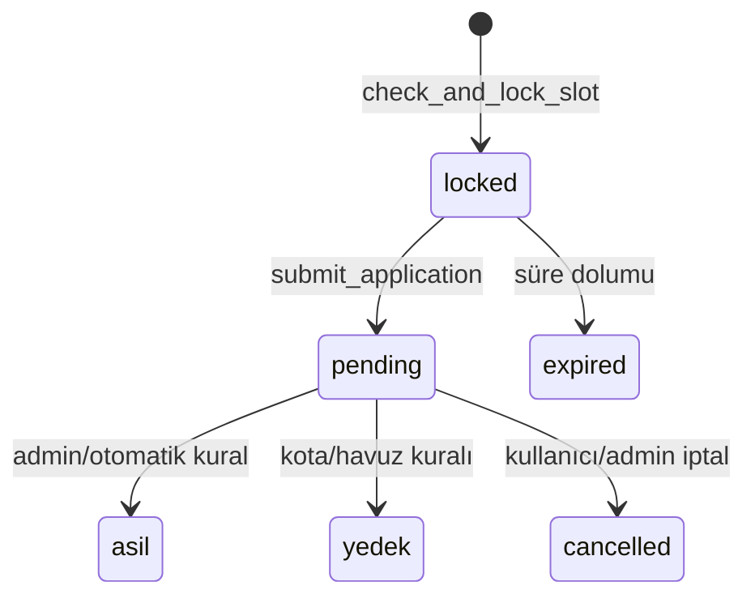
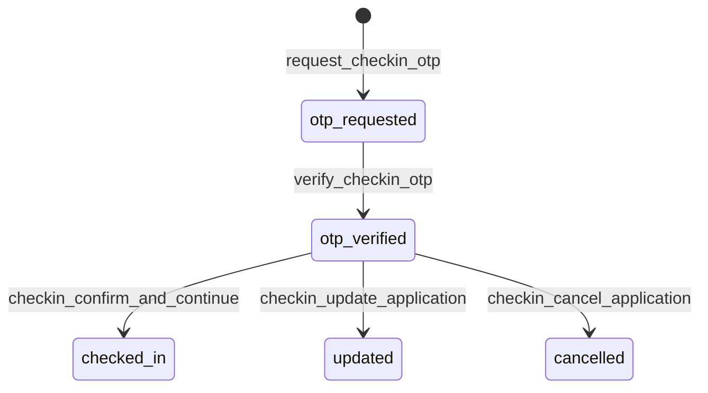

# API ve Veri Modeli Dokümantasyonu

Bu sistemde backend erişimi ağırlıklı olarak Supabase RPC ve tablo CRUD çağrıları üzerinden yürür.

## 1) API Surface (Frontend Perspektifi)

## A) RPC Fonksiyonları

### `check_and_lock_slot(p_tc_no: text)`
- Amaç: TC doğrulama sonrası geçici başvuru lock'u oluşturmak.
- Başlıca dönüş alanları:
  - `success: boolean`
  - `status: 'locked' | 'pending' | 'approved' | 'asil' | 'yedek'`
  - `ticket_type: 'asil' | 'yedek'`
  - `lock_expires_at: timestamptz`
  - `remaining_seconds: number`
  - `error_type?: 'not_found' | 'debtor' | 'quota_full' | ...`

### `submit_application(p_tc_no, p_data, p_bring_guest, p_user_id)`
- Amaç: Lock almış kullanıcının başvurusunu finalize etmek.
- Başlıca dönüş alanları:
  - `success: boolean`
  - `ticket_type: 'asil' | 'yedek'`
  - `attended_before: boolean`
  - `yedek_sira?: number`

### `get_ticket_stats()`
- Amaç: Dashboard ve public quota görünümü için aggregate metrik döndürmek.
- Çıktı: `total_reserved`, `total_capacity`, `asil_*`, `yedek_*` kırılımları.

### `get_yedek_sira(p_tc_no?)`
- Amaç: Yedek listedeki dinamik sıra numaralarını `ROW_NUMBER` ile üretmek.

### `get_table_stats()`
- Amaç: Masa/oturma tercih ekranına beslenen tablo yoğunluk verisi.

### `update_seating_preference(p_tc_no, p_preferences)`
- Amaç: Kullanıcının oturma tercih bilgisini güncellemek.

### `get_application_countdown_enabled()`
- Amaç: Başvuru geri sayımının DB üzerinden açık/kapalı yönetimi.

### `request_checkin_otp(p_tc_no: text)`
- Amaç: TC bazlı check-in OTP üretmek ve gönderimi tetiklemek.
- Başlıca dönüş alanları:
  - `success: boolean`
  - `masked_email?: string`
  - `cooldown_seconds?: number`
  - `error_type?: string`

### `verify_checkin_otp(p_tc_no: text, p_otp: text)`
- Amaç: OTP doğrulayıp kısa ömürlü check-in oturumu üretmek.
- Başlıca dönüş alanları:
  - `success: boolean`
  - `session_token?: string`
  - `application_summary?: object`
  - `error_type?: string`

### `get_checkin_context(p_session_token: text)`
- Amaç: Doğrulanmış kullanıcının check-in aksiyon ekranı verisini döndürmek.

### `checkin_confirm_and_continue(p_session_token: text, p_table_preferences: jsonb)`
- Amaç: Check-in'i tamamlamak ve kişi tercih listesini atomik kaydetmek.
- Not: `p_table_preferences` parametresi geriye dönük uyumluluk için korunmuştur; yeni modelde `preferred_people` dizisi beklenir.

### `checkin_update_application(p_session_token: text, p_patch: jsonb)`
- Amaç: İzinli alanlarda başvuru güncellemesi yapmak.

### `checkin_cancel_application(p_session_token: text, p_reason: text)`
- Amaç: Başvuruyu iptal akışına taşımak.

### `get_checkin_table_occupants(p_session_token: text, p_table_no: text)`
- Durum: **Kaldırıldı (hard cleanup, 2026-03-04)**.
- Not: Seatmap akışı tamamen devre dışıdır; aktif modelde bu RPC yoktur.

## B) Edge Function

### `send-bulk-email`
- Girdi:
  - `email_type` veya (`subject` + `message`)
  - `recipients[]`
  - `extra_data`
  - `target_group` (opsiyonel)
- Çıktı:
  - `success`
  - `sent`, `failed`
  - `results[]`

## C) Tablo CRUD Noktaları (Admin)
- `cf_whitelist`: ekleme/silme/toplu içe aktarma
- `cf_submissions`: listeleme, bilet tipi güncelleme, ödeme durumu güncelleme, silme
- `cf_quota_settings`: kota ve countdown ayarı
- `cf_email_templates`: şablon yönetimi
- `cf_smtp_settings`: SMTP ayarı
- `cf_audit_logs`: admin işlem kaydı

## 2) Veri Modeli (Canlı Şemaya Göre)

## `cf_submissions`
- Ana alanlar: `tc_no`, `status`, `ticket_type`, `ticket_count`, `is_confirmed`, `soft_lock_until`, `payment_status`, `data(jsonb)`
- İlişkiler: `form_id -> cf_forms.id`, `user_id -> auth.users.id`

## `cf_whitelist`
- Ana alanlar: `tc_no`, `attended_before`, `is_debtor`

## `cf_quota_settings`
- Ana alanlar:
  - `asil_returning_capacity`, `asil_new_capacity`, `total_capacity`
  - `countdown_enabled`
  - `applications_closed`, `checkin_enabled`, `otp_enabled`, `checkin_actions_enabled`

## `cf_checkin_otp_requests`
- Ana alanlar: `tc_no`, `email`, `otp_hash`, `expires_at`, `attempt_count`, `max_attempt`, `cooldown_until`, `consumed_at`

## `cf_checkin_sessions`
- Ana alanlar: `tc_no`, `session_token`, `expires_at`, `used_at`

## `cf_forms`
- Ana alanlar: `title`, `schema(jsonb)`, `is_active`

## E-posta tabloları
- `cf_email_templates`: `slug`, `subject`, `body_html`, `variables`, `is_active`
- `cf_smtp_settings`: `host`, `port`, `secure`, `username`, `from_email`, `admin_emails`
- `cf_email_logs`: gönderim logları

## Denetim
- `cf_audit_logs`: admin eylem izi (`action_type`, `target_tc`, değer değişimi)

## 3) Type Safety Kontratları (Önerilen TypeScript Arayüzleri)

Not: Uygulama şu an JS ağırlıklıdır. Devir sonrası bakım güvenliği için aşağıdaki kontratların `src/types/contracts.ts` altında kodlaştırılması önerilir.

```ts
export type TicketType = 'asil' | 'yedek';
export type SubmissionStatus =
  | 'locked'
  | 'pending'
  | 'approved'
  | 'asil'
  | 'yedek'
  | 'cancelled'
  | 'expired'
  | 'rejected';

export interface CheckAndLockSlotResponse {
  success: boolean;
  status?: SubmissionStatus;
  ticket_type?: TicketType;
  lock_expires_at?: string;
  remaining_seconds?: number;
  error_type?: string;
  message?: string;
  is_attended_before?: boolean;
}

export interface SubmitApplicationResponse {
  success: boolean;
  ticket_type: TicketType;
  attended_before: boolean;
  yedek_sira?: number;
}

export interface TicketStats {
  total_reserved: number;
  total_capacity: number;
  asil_capacity: number;
  yedek_capacity: number;
  asil_returning_capacity: number;
  asil_returning_reserved: number;
  asil_new_capacity: number;
  asil_new_reserved: number;
  yedek_returning_reserved: number;
  yedek_new_reserved: number;
}

export interface SubmissionData {
  name: string;
  airline: string;
  airlineOther?: string;
  fleet: string;
  fleetOther?: string;
  ageGroup: string;
  email: string;
  phone: string;
  bringGuest: boolean;
  guestName?: string;
}
```

## 4) Veri Akışı Kuralları

### Başvuru Yaşam Döngüsü


### Kritik İnvariantlar
- Bir TC için tek aktif submission kaydı (`tc_no` unique).
- Lock süresi aşıldığında `locked` kayıtların aktif kota etkisi düşmelidir.
- Quota hesaplarında `rejected/cancelled/expired` statüleri kapasite tüketmemelidir.
- `submit_application` duplicate çağrıda yeni satır üretmemeli, mevcut kaydı normalize etmelidir.

### Check-in Yaşam Döngüsü


### Check-in İnvariantları
- OTP plain-text verisi DB'de tutulmaz; hash saklanır.
- Check-in session token süreli ve tekil kullanım mantığıyla değerlendirilir.
- Seatmap akışı kaldırılmıştır; check-in tamamlamak için en az bir kişi tercihi (`preferred_people`) gerekir.
- `seating_preference` alanı artık kişi listesi modelini (`preferred_people`, `source`) taşır.
