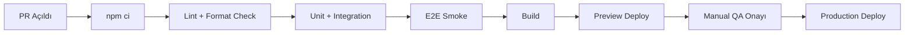

# Test ve Deployment Rehberi

## 1) Test Stratejisi

## Katmanlar
- Unit: `src/**/*.test.{js,jsx}`
- Integration: `tests/integration/**/*.test.js`
- Stress: `tests/stress/quota-race.test.js`
- E2E: `e2e/*.spec.js`

## Çalıştırma Matrisi
```bash
# Hızlı kalite kapısı
npm run test:unit

# İş kuralı + güvenlik
npm run test:integration
npm run test:security

# Uçtan uca
npm run test:e2e
npm run test:e2e:checkin

# Yoğunluk testi
npm run test:stress
```

## Kritik Senaryolar
- Quota dolu iken lock/submit davranışı
- Aynı TC ile tekrar başvuru engeli
- Lock süresi dolumu ve yeniden deneme
- Admin auth + protected route davranışı
- Email side-effect hatalarının ana akışı bloklamaması
- Check-in OTP doğrulama (doğru/yanlış/expire)
- Kişi tercihi ekleme/silme ve check-in kaydı
- Kişi tercihi boşken check-in butonunun pasif kalması

## 2) CI/CD Önerilen Pipeline



## Önerilen CI Adımları
1. `npm ci`
2. `npm run test:unit`
3. `npm run test:integration`
4. `npm run test:e2e:auth` (hızlı smoke)
5. `npm run build`

## 3) Supabase Migration ve Deploy Runbook

## Sıralama
1. Migration dosyalarını kronolojik sırada uygulayın.
2. Kritik RPC fonksiyon imzalarının değişmediğini doğrulayın.
3. Edge Function (`send-bulk-email`) deploy edin.
4. Frontend deploy ederek env değerlerini doğrulayın.

## Kontrol Listesi
- [ ] `VITE_SUPABASE_URL` ve `VITE_SUPABASE_ANON_KEY` doğru ortamda set edildi.
- [ ] `cf_quota_settings` satırı mevcut.
- [ ] `get_ticket_stats`, `check_and_lock_slot`, `submit_application` güncel sürümde.
- [ ] `request_checkin_otp`, `verify_checkin_otp`, `checkin_confirm_and_continue` güncel sürümde.
- [ ] Seatmap legacy cleanup migrationları uygulandı (`20260304130000`, `20260304133000`).
- [ ] Admin login (`/admin/login`) ve protected route erişimi çalışıyor.
- [ ] `vercel.json` SPA rewrite kuralı aktif.

## Check-in Cutover Kontrolü
- [ ] `applications_closed=true`
- [ ] `checkin_enabled=true`
- [ ] `otp_enabled=true`
- [ ] `checkin_actions_enabled=true`

## Rollback Stratejisi
- DB rollback için ilgili migration'ın ters script'i veya önceki fonksiyon tanımını hazır tutun.
- Frontend için önceki başarılı build artefact'ına hızlı dönüş mekanizması kurun.

## 4) Kod Standartları: ESLint + Prettier + Husky

Depoda bu dosyalar henüz bulunmuyor. Aşağıdaki baseline, devir sonrası ilk sprintte repo köküne eklenmelidir.

## `.eslintrc.cjs` (Önerilen)
```js
module.exports = {
  root: true,
  env: { browser: true, es2022: true, node: true },
  extends: ['eslint:recommended', 'plugin:react/recommended', 'plugin:react-hooks/recommended', 'prettier'],
  parserOptions: { ecmaVersion: 'latest', sourceType: 'module' },
  settings: { react: { version: 'detect' } },
  rules: {
    'react/react-in-jsx-scope': 'off',
    'no-console': ['warn', { allow: ['warn', 'error'] }],
  },
};
```

## `.prettierrc`
```json
{
  "singleQuote": true,
  "semi": true,
  "trailingComma": "all",
  "printWidth": 100
}
```

## `package.json` script ekleri (Önerilen)
```json
{
  "scripts": {
    "lint": "eslint . --ext .js,.jsx,.ts,.tsx",
    "format": "prettier . --write",
    "format:check": "prettier . --check"
  }
}
```

## Husky + lint-staged (Önerilen)
```bash
npm i -D husky lint-staged eslint prettier
npx husky init
```

`.husky/pre-commit`:
```bash
npx lint-staged
```

`package.json`:
```json
{
  "lint-staged": {
    "*.{js,jsx,ts,tsx}": [
      "eslint --fix",
      "prettier --write"
    ],
    "*.{json,md,css}": [
      "prettier --write"
    ]
  }
}
```

## 5) Canlıya Çıkış Protokolü
- T-1 gün: Stress testi ve quota raporu
- T-0: Migration + Edge deploy + smoke E2E
- T+1 saat: Admin dashboard metrik doğrulaması
- T+24 saat: Audit log ve email log post-check

## 6) Check-in + Kişi Tercihi Smoke Paketi (Önerilen)
- Senaryo 1: Geçerli TC -> OTP al -> OTP doğrula -> kişi ekle -> check-in tamamla
- Senaryo 2: Yanlış OTP ile başarısızlık -> doğru OTP ile başarı
- Senaryo 3: Kişi eklemeden check-in butonunun pasif kalması
- Senaryo 4: Kişi ekle/sil etkileşiminin mobil viewport'ta doğrulanması
