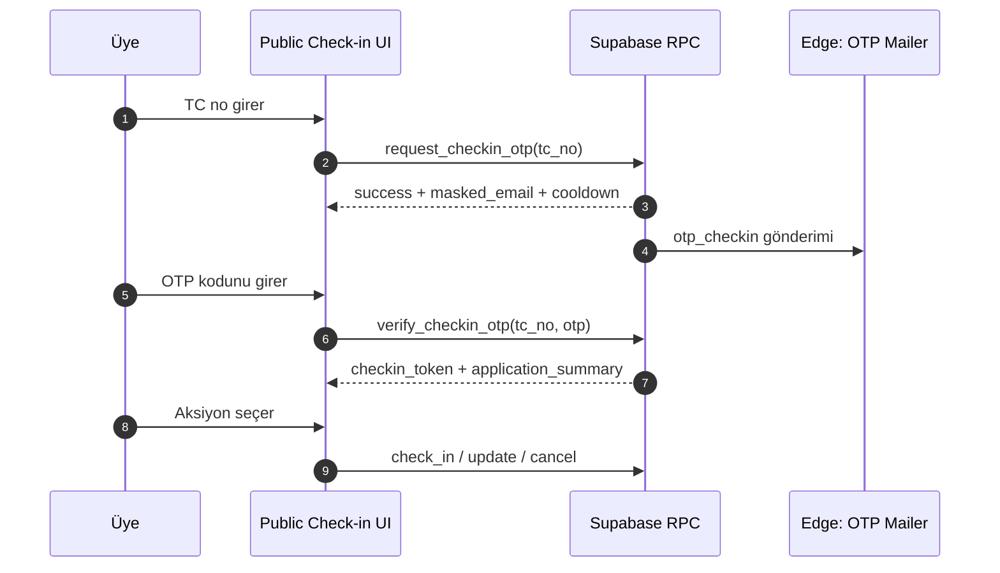

# Check-in + E-posta OTP Canlı Geçiş Planı

> **Not (2026-03-04):** Bu doküman canlıya geçiş planının tarihsel kaydıdır. Aktif üretim modeli seatmap yerine `preferred_people` (kişi tercih listesi) akışıdır.

Bu plan, mevcut canlı başvuru sistemine zarar vermeden başvurular kapandıktan sonra Check-in akışına güvenli geçiş için hazırlanmıştır.

## Durum Notu (2026-03-03)

Bu plandaki birçok kalem uygulanmıştır. Güncel durum:
- Tamamlandı: runtime flag mimarisi, TC + e-posta OTP, check-in aksiyon RPC'leri.
- Tamamlandı: seatmap kaldırma ve kişi tercih listesi (`preferred_people`) modeline geçiş.
- Tamamlandı: legacy teknik borç temizliği (`table_capacity` kolonu ve `get_checkin_table_occupants` RPC kaldırıldı).
- Kalan odak: canlı ortam cutover adımları, smoke/E2E doğrulama, ilk 24 saat izleme.

Detaylı durum + sonraki adımlar için: [10-checkin-seatmap-status-and-next-steps.md](10-checkin-seatmap-status-and-next-steps.md)

## 1) Amaç ve Kapsam

## Amaç
- Başvuru dönemi kapandığında public başvuru ekranı yerine Check-in ekranının açılması.
- Check-in kimlik doğrulamasının TC + e-posta OTP ile yapılması.
- OTP doğrulanan üyenin başvuru ve bilet tipini görmesi.
- Aksiyonlar: `Check-in yap ve Masa Seçimine devam et`, `Düzenle`, `İptal et`.

## Kapsam Dışı
- Mevcut başvuru akışının iş kurallarını değiştirmek.
- Destructive şema değişiklikleri (tablo silme, kolon kaldırma, mevcut RPC imza kırma).

## Temel Prensip
- **Flag-first, additive-only, dark-launch**: Tüm yeni davranışlar feature flag ile varsayılan kapalı gelir.

## 2) Canlı Güvenlik Stratejisi

## Feature Flag Matrisi
- `applications_closed`: `true` olduğunda public route check-in ekranını gösterir.
- `checkin_enabled`: Check-in UI ve RPC çağrıları aktif olur.
- `otp_enabled`: OTP üretme/doğrulama akışı aktif olur.
- `checkin_actions_enabled`: Check-in sonrası aksiyon butonlarını açar.

Öneri: Bu flagler `cf_quota_settings` içine yeni kolonlar olarak veya ayrı `cf_runtime_flags` tablosunda tutulabilir.

## Güvenli Yayın Kuralları
- Yeni migrationlar sadece ekleyici olacak.
- Yeni RPC isimleri mevcut fonksiyonlarla çakışmayacak.
- Public route değişikliği flag kontrollü olacak.
- OTP servisinde sorun olduğunda kill switch ile check-in akışı kapatılabilir.

## 3) Hedef Akış

## 4) Veri Modeli ve Backend Değişiklikleri

## Önerilen Yeni Tablolar

### `cf_checkin_otp_requests`
- `id uuid pk`
- `tc_no text not null`
- `email text not null`
- `otp_hash text not null`
- `expires_at timestamptz not null` (ör. 5 dk)
- `attempt_count int not null default 0`
- `max_attempt int not null default 5`
- `cooldown_until timestamptz`
- `consumed_at timestamptz`
- `created_at timestamptz default now()`

Index:
- `(tc_no, created_at desc)`
- `(expires_at)`

### `cf_checkin_sessions`
- `id uuid pk`
- `tc_no text not null`
- `session_token text not null unique`
- `expires_at timestamptz not null` (ör. 15 dk)
- `created_at timestamptz default now()`
- `used_at timestamptz`

## Önerilen Yeni RPC'ler

### `request_checkin_otp(p_tc_no text)`
- Üyeyi whitelist/submission üzerinden doğrular.
- Üyenin kayıtlı e-postasını belirler (submission data veya whitelist'teki alan).
- OTP üretir (6 hane), hash saklar, plain OTP sadece e-posta için kullanılır.
- Cooldown ve günlük limit uygular.
- Edge function ile e-posta tetikler.
- Dönüş: `success`, `masked_email`, `cooldown_seconds`, `error_type`.

### `verify_checkin_otp(p_tc_no text, p_otp text)`
- Aktif OTP kaydını bulur, TTL ve deneme sayısı kontrolü yapar.
- Doğruysa OTP kaydını consume eder.
- Kısa ömürlü check-in session token üretir.
- Başvuru özeti döndürür: `ticket_type`, `status`, temel başvuru alanları.

### `get_checkin_context(p_session_token text)`
- Session geçerliyse kullanıcının aksiyon ekranı verisini döndürür.

### `checkin_confirm_and_continue(p_session_token text, p_table_preferences jsonb)`
- Check-in işlemini tamamlar ve masa seçimi güncellemesini atomik yapar.

### `checkin_update_application(p_session_token text, p_patch jsonb)`
- İzinli alanlarda düzenleme yapar (strict allowlist).

### `checkin_cancel_application(p_session_token text, p_reason text)`
- Kayıt durumunu iptal akışına taşır, audit log yazar.

## RLS ve Güvenlik
- OTP tabloları yalnızca RPC üzerinden erişilebilir olacak (direct select/insert yok).
- OTP plain-text DB'de tutulmaz; sadece hash saklanır.
- OTP deneme limiti + cooldown + TTL zorunlu.
- RPC sonuçları enumeration riskini azaltacak şekilde normalize edilir (aşırı bilgi sızdırmadan).

## 5) Frontend Değişiklik Planı

## Route Davranışı
- Public route (`/`) karar mekanizması:
  1. `applications_closed=false` ise mevcut başvuru ekranı aynen devam.
  2. `applications_closed=true` ve `checkin_enabled=true` ise Check-in ekranı.
  3. Flag uyumsuzluğu varsa güvenli fallback: bilgilendirme mesajı.

## Yeni UI Akışları
- Adım 1: TC giriş ekranı + OTP iste butonu.
- Adım 2: OTP doğrulama ekranı (kalan süre, tekrar gönder cooldown).
- Adım 3: Özet ve aksiyon ekranı:
  - `Check-in yap ve Masa Seçimine devam et`
  - `Düzenle`
  - `İptal et`

## UX Güvenlik Detayları
- Hata mesajları teknik detay sızdırmayacak.
- Rate-limit durumları net ama güvenli metinle gösterilecek.
- Session token local state'te kısa süreli tutulacak; kalıcı storage kullanımından kaçınılacak.

## 6) Test Planı

## Unit (Vitest)
- OTP code format/validator
- Cooldown sayaç hesaplaması
- Check-in state machine (idle -> otp_sent -> verified -> action_done)
- Error mapper (rate limit, expired, invalid otp)

## Integration (Supabase / RPC)
- `request_checkin_otp`: geçerli/geçersiz TC, cooldown, daily limit
- `verify_checkin_otp`: doğru kod, yanlış kod, expire kod, max attempt
- `checkin_*` aksiyonları: token expire, replay attack, idempotency
- RLS: OTP tablolarına direct erişim reddi

## E2E (Playwright)
- Başvuru açıkken mevcut akış smoke (regresyon)
- Başvuru kapalıyken check-in happy path
- Yanlış OTP -> doğru OTP
- OTP süresi dolmuş senaryo
- Düzenle akışı
- İptal akışı
- Check-in + masa seçimi tamamla

## Stress / Concurrency
- Aynı TC için paralel OTP istekleri (tek aktif OTP politikası)
- Aynı OTP ile paralel verify çağrısı (tek tüketim)
- Check-in aksiyonlarında double-submit denemesi

## Observability Testleri
- OTP gönderim başarısızlık oranı
- OTP doğrulama başarısızlık oranı
- Check-in completion oranı
- Edge function hata logları

## 7) Yayın (Release) Planı

## Faz 0 — Hazırlık
- Branch: `feature/checkin-otp`
- Migration + RPC + Edge function kodu eklenir, flagler kapalı tutulur.
- Staging ortamına deploy edilir.

## Faz 1 — Dark Launch
- Prod deploy yapılır ama tüm check-in flagleri kapalıdır.
- Regresyon smoke test: mevcut başvuru akışı çalışıyor olmalı.

## Faz 2 — Internal Pilot
- `checkin_enabled=true`, `otp_enabled=true` yalnızca internal whitelist için (RPC içi guard).
- Gerçek e-posta OTP teslimatı doğrulanır.

## Faz 3 — Cutover
- Başvurular kapanış anında:
  - `applications_closed=true`
  - `checkin_actions_enabled=true`
- İlk 30 dk canlı izleme + alarm takibi.

## Faz 4 — Stabilizasyon
- 24 saat metrik takibi
- Sorun yoksa pilot guard kaldırılır.

## 8) Rollback ve Acil Durum

## Hızlı Geri Alma (Öncelik)
1. `applications_closed=false` ile mevcut başvuru ekranına geri dön.
2. `otp_enabled=false` ile OTP akışını kapat.
3. `checkin_enabled=false` ile check-in'i tamamen devre dışı bırak.

## Teknik Rollback
- Son migration destructive olmadığı için veri kaybı olmadan feature kapatılabilir.
- Gerekirse yeni rollback migration ile sadece check-in objeleri pasife alınır.

## 9) Sprint Bazlı İş Kırılımı (Öneri)

## Sprint 1 (Backend Temel)
- OTP tabloları + RPC iskeleti + RLS + audit
- OTP e-posta şablonu + Edge function entegrasyonu
- Integration testlerin ilk seti

## Sprint 2 (Frontend + E2E)
- Check-in UI 3 adım
- Route switch + feature flag entegrasyonu
- E2E senaryoları + regresyon smoke

## Sprint 3 (Pilot + Canlı Geçiş)
- Internal pilot
- Cutover runbook uygulaması
- Post-release izleme ve iyileştirme

## 10) Kabul Kriterleri
- Başvuru açıkken mevcut akışta regresyon yok.
- Başvuru kapalıyken Check-in akışı TC + e-posta OTP ile çalışıyor.
- OTP güvenlik kontrolleri (TTL, deneme limiti, cooldown) aktif.
- Üye doğrulama sonrası başvuru ve bilet tipi görüntüleniyor.
- 3 aksiyon (`Check-in/Masa`, `Düzenle`, `İptal`) beklenen sonucu üretiyor.
- Kill switch ile 5 dakika altında güvenli geri alma mümkün.
