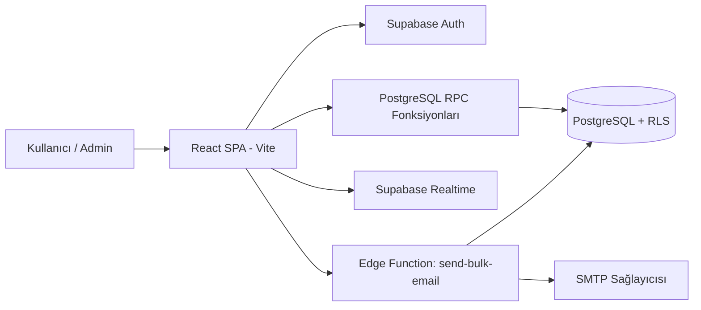
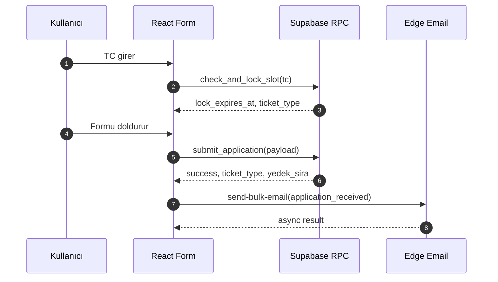

# TALPA DPG 2026 Devir Dokümantasyonu

Bu doküman, projeyi devralacak outsource ekibin sistemin davranışını, kritik risk noktalarını ve operasyonel süreçleri hızlıca içselleştirmesi için hazırlanmıştır.

## 1. Genel Bakış ve Kurulum

### Sistem Özeti
- Mimari: SPA (React + Vite) + BaaS (Supabase).
- Domain: Etkinlik başvurusu, kota yönetimi, whitelist doğrulama, admin operasyonları.
- Güvenlik modeli: Supabase Auth + RLS + SECURITY DEFINER RPC.

### Bağımlılıklar
- Node.js: `20.x`
- Paket yöneticisi: `npm`
- Frontend: React, React Router, Tailwind, Zod, React Hook Form
- Test: Vitest, Playwright

### Environment Değişkenleri
```bash
VITE_SUPABASE_URL=<supabase-project-url>
VITE_SUPABASE_ANON_KEY=<supabase-anon-or-publishable-key>
VITE_ENABLE_APPLICATION_COUNTDOWN=true
```

Notlar:
- `VITE_ENABLE_APPLICATION_COUNTDOWN=false` verilirse form geri sayım beklemeden açılır.
- DB'deki `cf_quota_settings.countdown_enabled` değeri runtime'da env davranışını override edebilir.

### Çalıştırma Komutları
```bash
npm install
npm run dev
npm run build
npm run preview
```

### Test Komutları
```bash
npm run test
npm run test:coverage
npm run test:integration
npm run test:e2e
npm run test:stress
```

## 2. Mimari Tasarım

Detaylı sürüm: [01-architecture-and-folder-structure.md](01-architecture-and-folder-structure.md)

### Sistem Mimarisi (Mermaid)


### Klasör Hiyerarşisi (Özet)
- `src/components`: Public + admin UI bileşenleri
- `src/hooks`: Form iş kuralları ve state orkestrasyonu
- `src/lib`: Supabase client, validation, email template yardımcıları
- `supabase/migrations`: DB iş kurallarının versiyonlu evrimi
- `supabase/functions`: Edge functionlar
- `e2e` ve `tests`: Uçtan uca, integration ve stress testleri

## 3. Kritik Mantık Blokları (AI-Optimized)

Detaylı sürüm: [02-adr-and-ai-logic-review.md](02-adr-and-ai-logic-review.md)

### AI-Generated Logic Review

#### A) `check_and_lock_slot` (DB RPC)
- Amaç: Aynı anda çok kullanıcılı başvuru akışında adil ve atomik lock dağıtımı.
- Strateji:
  1. Whitelist + borç kontrolü
  2. Advisory lock (`pg_advisory_xact_lock`) ile kritik bölüm serileştirme
  3. Hard quota (onaylı başvurular) + soft buffer (aktif locklar) ayrımı
  4. Eski/yeni katılımcı için dual asil havuz hesaplama
  5. `ticket_count=2` spekülatif lock ile misafir olasılığını erken rezerv etme
- Neden seçildi: Yüksek concurrency altında oversubscription riskini azaltır, lock starvation riskini buffer ile dengeler.

#### B) `submit_application` (DB RPC)
- Amaç: Lock alınmış adayın kesin başvurusunu idempotent ve yarışa dayanıklı finalize etmek.
- Strateji:
  1. Girdi doğrulama + whitelist + borç kontrolü
  2. Advisory lock ile atomik quota hesaplama
  3. Gerçek bilet sayısı (`1/2`) ile lock tahsisini doğrulama
  4. `ON CONFLICT (tc_no)` ile upsert + statü dönüşüm kuralı
  5. Yedek için dinamik sıra (`get_yedek_sira`) döndürme
- Neden seçildi: Tekrarlı isteklerde tutarlı sonuç üretir; front-end yeniden denemelerinde veri bütünlüğünü korur.

#### C) `useApplicationForm` (Frontend Hook)
- Amaç: 3-adımlı form sürecinin tek noktadan yönetilmesi.
- Strateji:
  1. TC doğrulama + lock RPC
  2. Drift üretmeyen countdown (mutlak zaman farkı)
  3. Form submit RPC + asenkron e-posta bildirim tetikleme
  4. Hata tipine göre kullanıcıya domain-uyumlu mesajlaştırma
- Neden seçildi: UI karmaşıklığını azaltır; iş kuralı ile sunum katmanını ayrıştırır.

## 4. API ve Veri Akışı

Detaylı sürüm: [03-api-and-data-model.md](03-api-and-data-model.md)

### Frontend ↔ Backend Akışı (Mermaid)


### Çekirdek Veri Varlıkları
- `cf_whitelist`: TC bazlı üyelik uygunluğu, `attended_before`, `is_debtor`
- `cf_submissions`: Başvuru yaşam döngüsü, lock/pending/asil/yedek durumları
- `cf_quota_settings`: Dinamik kapasite ve countdown kontrolü
- `cf_email_templates`, `cf_smtp_settings`, `cf_email_logs`: Bildirim altyapısı
- `cf_audit_logs`: Admin operasyon kayıtları

## 5. Kalite Güvence ve Dağıtım

Detaylı sürüm: [04-test-and-deployment-guide.md](04-test-and-deployment-guide.md)

### QA Protokolü
- Unit: Validation, hook ve statik component davranışları
- Integration: RLS/security ve iş kuralı senaryoları
- E2E: Admin auth, başvuru akışı, quota full durumları
- Stress: Eşzamanlı lock/submit yarış testleri

### Dağıtım
- Frontend hedefi: Vercel (`vercel.json` ile SPA rewrite)
- Backend hedefi: Supabase migrations + Edge Functions deploy
- Zorunlu kontrol: migration sırası ve rollback planı

### Kod Standartları (Dokümante Edilen Baseline)
Bu depoda aktif ESLint/Prettier/Husky dosyaları henüz bulunmuyor. Devir sonrası ilk sprintte aşağıdaki standartların repo düzeyinde aktive edilmesi zorunludur:
- ESLint: React + hooks + import sıralama kuralları
- Prettier: tek format kaynağı
- Husky + lint-staged: commit öncesi format + lint + hızlı test
