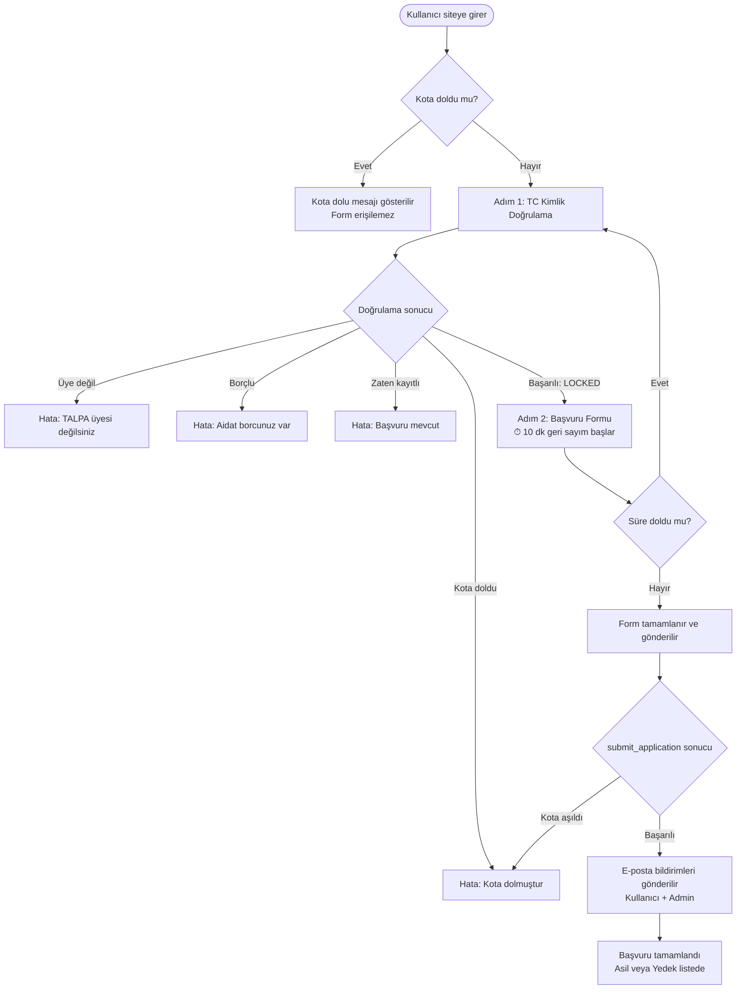
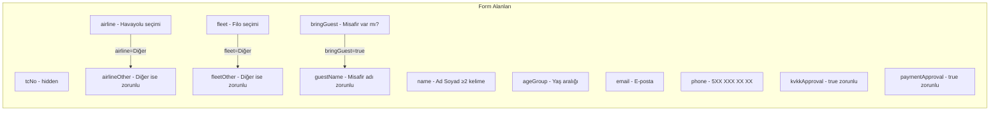
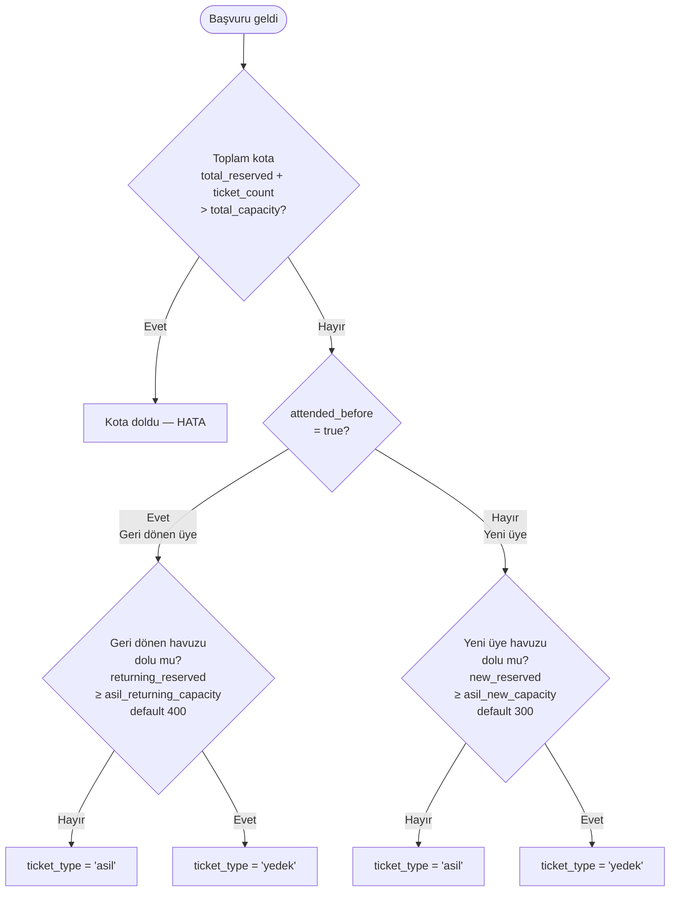
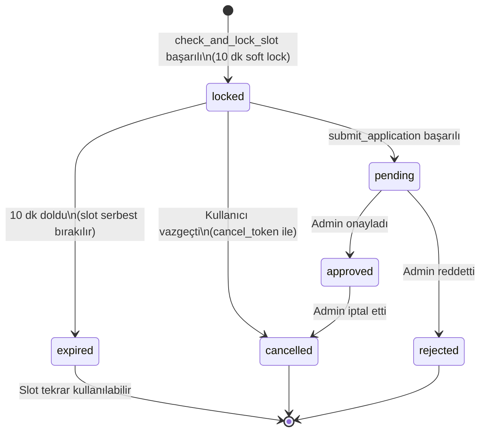
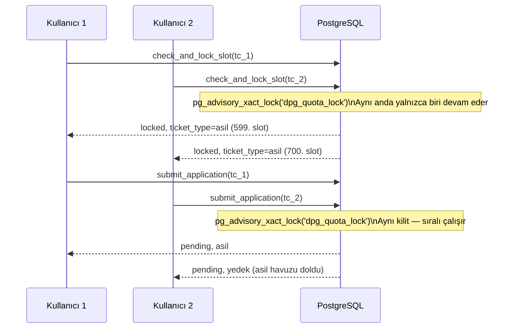

# DPG 2026 — Başvurucu Kullanıcı Akışı ve İş Mantığı Raporu

---

## 1. Üst Düzey Genel Bakış



---

## 2. Adım Adım Kullanıcı Akışı

### Adım 1 — TC Kimlik Doğrulama (`check_and_lock_slot`)

#### Frontend Kontrolleri (istemci tarafı)

- 11 rakam olmalı; rakam dışı karakter kabul edilmez
- Resmi Türk TC Kimlik algoritması (`isValidTCKimlikNo`):
  - Basamak 10 = `(1+3+5+7+9. rakamlar × 7 − 2+4+6+8. rakamlar) % 10`
  - Basamak 11 = tüm 10 rakam toplamı % 10

#### RPC Kontrolleri (sunucu tarafı — sıralı, transaction içinde)

| Adım | Sorgu | Başarısızlıkta |
|------|-------|----------------|
| 1 | Aktif form var mı? (`cf_forms.is_active = true`) | `form_not_found` |
| 2 | Dinamik kota okunur (`cf_quota_settings`) | Varsayılan: 1500 / 400 / 300 |
| 3 | Whitelist kontrolü (`cf_whitelist.tc_no = ?`) | `not_found` |
| 4 | Borç kontrolü (`cf_whitelist.is_debtor = true`) | `debtor` |
| 5 | **Advisory Lock** alınır (`dpg_quota_lock`) | — |
| 6 | Mevcut başvuru kontrolü (`cf_submissions`) | Zaten kayıtlı |
| 7 | Toplam kota kontrolü | `quota_full` |
| 8 | Bilet türü belirlenir | → `asil` / `yedek` |
| 9 | `cf_submissions` satırı oluşturulur/güncellenir | — |

**Başarı durumunda dönen veri:**
```json
{
  "success": true,
  "status": "locked",
  "ticket_type": "asil | yedek",
  "lock_expires_at": "<UTC timestamp>",
  "remaining_seconds": 600,
  "is_attended_before": true | false
}
```

---

### Adım 2 — Başvuru Formu (`submit_application`)



#### 10 Dakika Geri Sayım Mekanizması

- `lock_expires_at` mutlak UTC zamanı olarak saklanır (drift olmaz)
- Her 500ms'de bir kalan süre yeniden hesaplanır: `lockExpiresAt.getTime() - Date.now()`
- Süre dolduğunda kullanıcı **Adım 1'e** geri atılır, `cf_submissions.status = 'locked'` satırı geçersiz kalır

#### `submit_application` RPC sırası

1. TC formatı tekrar doğrulanır
2. `ticket_count = bringGuest ? 2 : 1`
3. Aktif form kontrolü
4. Dinamik kota okunur
5. Whitelist'te `attended_before` değeri alınır
6. Advisory Lock (`dpg_quota_lock`) alınır
7. Mevcut başvuru kontrolü
8. Toplam kota kontrolü (`total_reserved + ticket_count > total_capacity`)
9. Bilet türü belirlenir (çift havuz mantığı)
10. `cf_submissions` tablosuna `INSERT … ON CONFLICT (tc_no) DO UPDATE`

---

## 3. Kota ve Bilet Türü İş Mantığı (Çift Havuz)



### Kapasite Tablosu (`cf_quota_settings`)

| Alan | Varsayılan | Açıklama |
|------|-----------|----------|
| `total_capacity` | 1500 | Toplam bilet kapasitesi |
| `asil_returning_capacity` | 400 | Önceki etkinliğe katılanlar için asil kontenjan |
| `asil_new_capacity` | 300 | Yeni katılımcılar için asil kontenjan |
| Asil toplam | 700 | 400 + 300 |
| Yedek | 800 | 1500 − 700 |

---

## 4. Başvuru Durum (Status) Makine Diyagramı



---

## 5. E-Posta Bildirimleri

Başvuru başarıyla tamamlandıktan sonra **arka planda** (hata akışı bloklamamaz) iki e-posta tetiklenir:

| Alıcı | `email_type` | İçerik |
|-------|-------------|--------|
| Kullanıcı | `application_received` | Bilet türü (Asil/Yedek), yedek sıra numarası |
| Admin (`dpg@talpa.org`) | `admin_new_application` | Tam başvuru özeti |

---

## 6. Eşzamanlılık (Concurrency) Koruması



- `check_and_lock_slot` ve `submit_application` her ikisi de aynı `hashtext('dpg_quota_lock')` anahtarını kullanır
- Bu sayede TC doğrulama ve form gönderimi arasında kota kaynağı yarışı (race condition) oluşmaz

---

## 7. Hata Senaryoları ve Kullanıcı Mesajları

| `error_type` | Kim tarafından döner | Kullanıcıya gösterilen |
|-------------|---------------------|----------------------|
| `not_found` | `check_and_lock_slot` | "TALPA üyesi değilsiniz" + üyelik bağlantısı |
| `debtor` | `check_and_lock_slot` | "Aidat borcunuz var" + ödeme bağlantısı |
| `quota_full` | Her iki RPC | "Asil ve yedek kotalar dolmuştur" |
| `already_submitted` (pending/approved) | `check_and_lock_slot` | "Bu TC ile daha önce başvuru yapılmıştır" |
| `locked` (aktif kilit) | `check_and_lock_slot` | Devam eden oturum bilgisi, kalan süre |
| Lock süresi doldu | Frontend timer | "Süreniz doldu, lütfen TC'nizi tekrar giriniz" → Adım 1 |
| Kota aşımı (`submit_application` sırasında) | `submit_application` | "Kota dolmuştur" |
| Ağ / bilinmeyen hata | any | "Sistem hatası, lütfen tekrar deneyin" |

---

## 8. Kota İzleme (Frontend)

- Sayfa yüklendiğinde `get_ticket_stats()` RPC çağrılır
- **Her 10 saniyede** tekrar çağrılarak kota durumu canlı güncellenir
- `total_reserved >= total_capacity` olduğunda form tamamen devre dışı kalır, sadece "kota dolu" mesajı gösterilir

---

## 9. Teknik Özet Tablosu

| Katman | Teknoloji / Bileşen |
|--------|---------------------|
| Frontend state | `useApplicationForm` hook (React, 3 adım) |
| Form validasyonu | Zod schema (`applicationFormSchema`) |
| RPC: slot kilitleme | `check_and_lock_slot` (PostgreSQL, SECURITY DEFINER) |
| RPC: form gönderme | `submit_application` (PostgreSQL, SECURITY DEFINER) |
| RPC: kota okuma | `get_ticket_stats` (dinamik, `cf_quota_settings`) |
| Concurrency koruması | `pg_advisory_xact_lock(hashtext('dpg_quota_lock'))` |
| Kota havuzu sistemi | Çift havuz: geri dönen (400) + yeni (300) |
| Soft lock süresi | 10 dakika (`soft_lock_until`) |
| E-posta bildirimleri | Supabase Edge Function `send-bulk-email` (arka plan) |
| Auth | Supabase Auth — yalnızca admin; form public |
